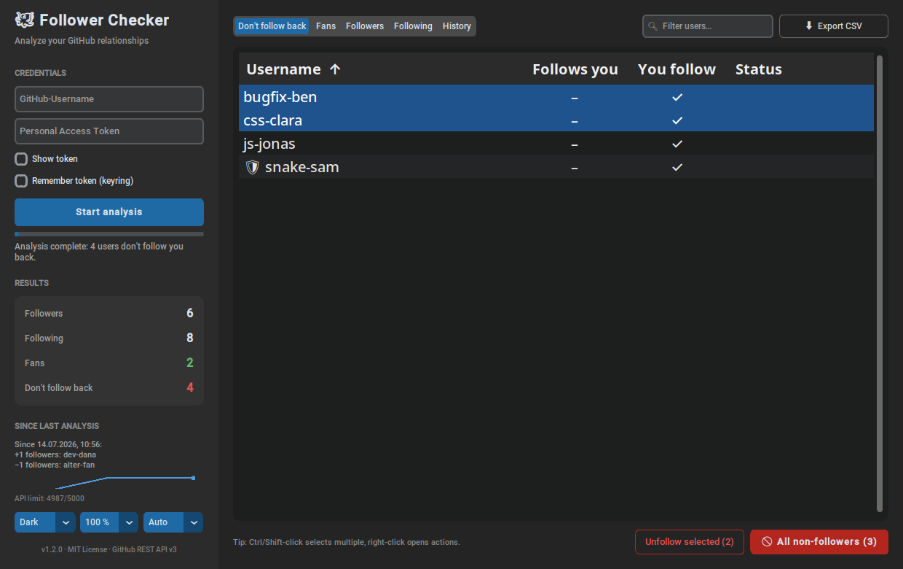

<p align="center"></p>

# 🐙 GitHub Follower Checker

[Deutsch](README.md) · **English**

[](https://www.python.org/)
[](https://github.com/0xGI0/GitHub-Follower-Checker/actions/workflows/ci.yml)
[](LICENSE)

Desktop tool for analyzing your **GitHub follower/following relationships** –
with a modern CustomTkinter interface, a sortable results table, CSV export
and optional **unfollowing**: everyone who doesn't follow you back with one
click, or precisely the users you select.

---

## 📸 Screenshot



---

## ✨ Features

* **Modern GUI** (CustomTkinter, dark mode by default, switchable to light)
* **Bilingual (English/German)**: follows your system language,
  switchable via the language menu in the bottom-left corner (Auto/DE/EN)
* **HiDPI-ready**: display scaling is detected automatically, zoom
  (100–200 %) selectable; zoom, theme and window size are stored locally
  (`~/.config/github-follower-checker/`, never credentials)
* **Sortable results table** with five views: don't follow back, fans
  (follow you, you don't follow them), followers, following, and a history
  view showing who followed/unfollowed you and when
* **Search box** to filter the table, **CSV export** of the current view
* **Profile panel**: selecting a user shows their avatar, name, bio and
  follower counts below the table
* **Secure token entry**: masked input; by default the token is kept in
  memory only – optionally "remember token" stores it in the
  **system keyring** (never in a file)
* **Responsive UI**: all API calls run in a background thread, with live
  progress and a remaining API quota indicator
* **Unfollow with confirmation** and per-user status:
  + **"Alle Nicht-Folgenden"** unfollows everyone who doesn't follow back
    (🛡-protected users are skipped)
  + **"Auswahl entfolgen"** unfollows only the selected rows
    (Ctrl/Shift-click for multi-select)
  + **"↩ Rückgängig"** re-follows the users you just unfollowed
* **Whitelist**: protect users via right-click (🛡) so bulk unfollow skips them
* **Right-click menu & double-click**: open profile in browser, follow
  (e.g. follow fans back), unfollow, protect
* **History**: after each analysis the sidebar shows who followed or
  unfollowed you since the last run, plus a small follower trend chart
  (stored locally, usernames only)

---

## 🧩 Setup

**Easiest:** grab a prebuilt binary (no Python required) from the
[releases page](https://github.com/0xGI0/GitHub-Follower-Checker/releases).

**From source** (Python 3.9+):

```bash
git clone https://github.com/0xGI0/GitHub-Follower-Checker.git
cd GitHub-Follower-Checker
pip install -r requirements.txt
```

Only the official **GitHub REST API v3** is used.

---

## 🔑 Create a GitHub Personal Access Token (PAT)

1. On GitHub open:
   `Settings` → `Developer settings` → `Personal access tokens` → `Tokens (classic)`
2. Click **"Generate new token (classic)"**
3. Pick a name, e.g. `GitHub Follower Checker`
4. Select at least this scope: **`user:follow`** (for analysis and unfollowing)
5. Generate the token and **store it safely** (it is shown in full only once)

---

## ▶️ Usage

### 🖥️ GUI (recommended)

```bash
python GitHubFollowerCheckerGUI.py
```

Missing packages are installed automatically on first start, so
double-click launching works on Windows, macOS and Linux.

1. Enter your GitHub username and token
2. Click **"Analyse starten"** – progress is shown live
3. Review, sort, filter or export the results; right-click a row for
   actions, double-click to open the profile
4. Optionally unfollow – in bulk or by selection, always with a
   confirmation dialog, per-user status and an undo button

### 💻 CLI

The token comes from `--token`, the `GITHUB_TOKEN` environment variable or
a secure prompt (never hardcoded):

```bash
python GitHubFollowerCheckerCLI.py YOUR_USERNAME             # analyze only
python GitHubFollowerCheckerCLI.py YOUR_USERNAME --json      # machine-readable
python GitHubFollowerCheckerCLI.py YOUR_USERNAME --unfollow  # unfollow (asks first)
python GitHubFollowerCheckerCLI.py YOUR_USERNAME --unfollow --yes --quiet  # scripting
```

The CLI honors the GUI's 🛡 whitelist, pauses between requests and also
supports `--version` and `--quiet`.

---

## 🔒 Security & privacy

* **Never commit a token.** By default the token lives only in memory;
  the opt-in "remember token" feature uses the system keyring, never a file.
* Use a **dedicated token** with the `user:follow` scope only.
* Exported CSV files contain usernames – `.gitignore` already excludes `*.csv`.
* The local history (`~/.config/github-follower-checker/history.json`) and
  the whitelist contain **usernames only**, never credentials.
* The tool respects GitHub rate limits by pausing between requests and
  shows when the limit resets.

---

## 🧪 Development

```bash
pip install -e ".[dev]"
ruff check .   # lint
mypy GitHubFollowerCheckerGUI.py GitHubFollowerCheckerCLI.py   # types
pytest         # tests (the GUI test needs a display; CI uses Xvfb)
```

Every push runs lint, type checks and tests via **GitHub Actions**.
A `v*` git tag triggers the release workflow which builds Windows and
Linux binaries. See the [CHANGELOG](CHANGELOG.md).

---

## 📄 License

This project is licensed under the [MIT license](LICENSE).

---

## ⚠️ Disclaimer

This tool is provided "as is" – use it at **your own risk**. The author
accepts no liability for lost followers, possible violations of GitHub's
Terms of Service, or other unwanted consequences.

**Recommendation:** try the tool with a small account first.

---

**Built with ❤️ for the GitHub community**
