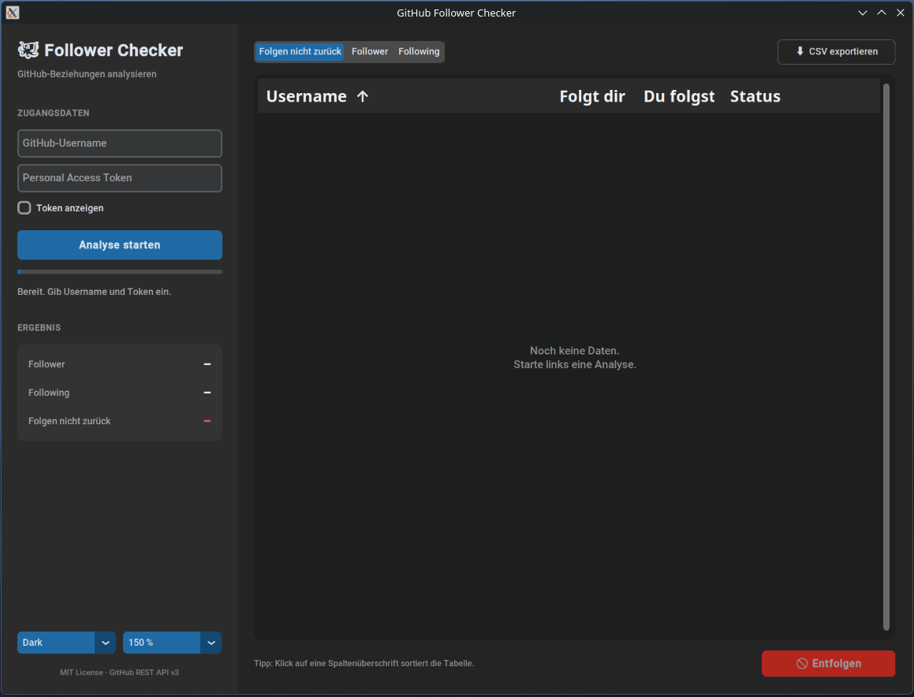

# 🐙 GitHub Follower Checker

[](https://www.python.org/)
[](LICENSE)
[](https://github.com/QG1o/GitHub-Follower-Checker/stargazers)

Desktop-Tool zum Analysieren deiner **GitHub-Follower/Following-Beziehungen** – mit moderner
CustomTkinter-Oberfläche, sortierbarer Ergebnistabelle, CSV-Export und optionalem
**Entfolgen** von Nutzern, die dir nicht zurückfolgen.

---

## 📸 Screenshot



---

## ✨ Features

* **Moderne GUI** (CustomTkinter, Dark Mode als Standard, Light Mode umschaltbar)
* **HiDPI-tauglich**: Display-Skalierung wird automatisch erkannt,
  Zoom (100–200 %) per Dropdown einstellbar – Zoom und Theme werden lokal
  gespeichert (`~/.config/github-follower-checker/`, keine Zugangsdaten)
* **Sortierbare Ergebnistabelle** mit drei Ansichten:
  + Folgen nicht zurück
  + Follower
  + Following
  + Klick auf eine Spaltenüberschrift sortiert auf-/absteigend
* **CSV-Export** der aktuellen Ansicht
* **Sichere Token-Eingabe**
  + Maskiertes Eingabefeld (einblendbar per Checkbox)
  + Token wird **nicht gespeichert und nicht geloggt** – es bleibt nur im Arbeitsspeicher
* **Reaktionsfähige Oberfläche**
  + Alle API-Abfragen laufen in einem Hintergrund-Thread
  + Ladeindikator und Live-Status während der Analyse
  + Fortschrittsbalken beim Entfolgen
* **Verständliche Fehlermeldungen**
  + GitHub-Rate-Limit wird erkannt und mit Uhrzeit der Freigabe angezeigt
  + Klare Hinweise bei ungültigem Token oder Netzwerkproblemen
* **Entfolgen mit Sicherheitsabfrage** und Statusanzeige pro Nutzer

---

## 🧩 Setup

**Voraussetzung:** Python 3.9+

```bash
git clone https://github.com/QG1o/GitHub-Follower-Checker.git
cd GitHub-Follower-Checker
pip install -r requirements.txt
```

Es wird ausschließlich die offizielle **GitHub REST API v3** verwendet.

---

## 🔑 GitHub Personal Access Token (PAT) erstellen

1. Öffne auf GitHub:
   `Settings` → `Developer settings` → `Personal access tokens` → `Tokens (classic)`
2. Klicke **„Generate new token (classic)"**
3. Vergib einen Namen, z. B. `GitHub Follower Checker`
4. Wähle mindestens diesen Scope:
   * **`user:follow`** (für Analyse und Entfolgen)
5. Token generieren und **sicher speichern** (wird nur einmal vollständig angezeigt)

---

## ▶️ Ausführung

### 🖥️ GUI-Version (empfohlen)

```bash
python GitHubFollowerCheckerGUI.py
```

Fehlende Pakete installiert das Skript beim ersten Start automatisch –
dadurch funktioniert auch der Start per **Doppelklick** (Windows, Mac, Linux).

**So funktioniert's:**

1. GitHub-Username eintragen
2. Personal Access Token einfügen (maskiert, wird nirgends gespeichert)
3. **„Analyse starten"** klicken – der Fortschritt wird live angezeigt
4. Ergebnisse in der Tabelle prüfen, bei Bedarf sortieren oder als **CSV exportieren**
5. Optional: **„Entfolgen"** klicken – nach Bestätigungsdialog wird jedem Nutzer
   aus der Ansicht „Folgen nicht zurück" entfolgt, mit Status pro Nutzer

### 💻 CLI-Version

Für die Kommandozeile (ohne GUI):

```bash
python GitHubUnfollowerToollong.py
```

Vorher im Skript `USERNAME` und `TOKEN` eintragen. Das Skript listet alle Nutzer,
die dir nicht zurückfolgen, und fragt vor dem Entfolgen nach Bestätigung (`ja`/`nein`).

> **Wichtig:** Die Datei mit eingetragenem Token **niemals committen oder hochladen**.

---

## 🔒 Sicherheit & Hinweise

* **Kein Token committen!** Die GUI speichert das Token bewusst nicht –
  es muss bei jedem Start neu eingegeben werden.
* Nutze wenn möglich einen **separaten Token** nur für dieses Tool.
* Exportierte CSV-Dateien enthalten Nutzernamen – `.gitignore` schließt `*.csv` bereits aus.
* Das Tool respektiert GitHub-Rate-Limits durch Pausen zwischen Requests und
  zeigt bei Erreichen des Limits an, ab wann es weitergeht.

---

## 🐛 Fehlerbehebung

| Problem | Ursache / Lösung |
|---|---|
| „Token ungültig oder abgelaufen" | Token prüfen, ggf. neu erstellen; Scope `user:follow` erforderlich |
| „GitHub-Rate-Limit erreicht" | Warten bis zur angezeigten Uhrzeit, dann erneut versuchen |
| „GitHub-API-Fehler (HTTP 404)" | Username prüfen – existiert der Account? |
| „Keine Verbindung zur GitHub-API" | Internetverbindung / Firewall prüfen |
| GUI startet nicht | `pip install -r requirements.txt` ausführen und im Terminal starten |

---

## 📄 Lizenz

Dieses Projekt steht unter der [MIT-Lizenz](LICENSE).

---

## ⚠️ Haftungsausschluss

Dieses Tool wird „wie besehen" bereitgestellt. Nutze es auf **eigene Verantwortung**.
Der Autor übernimmt keine Haftung für Verlust von Followern, mögliche Verstöße gegen
GitHubs Terms of Service oder andere unerwünschte Folgen.

**Empfehlung:** Teste das Tool zunächst mit einem Account, der wenige Follower hat.

---

**Erstellt mit ❤️ für die GitHub Community**
